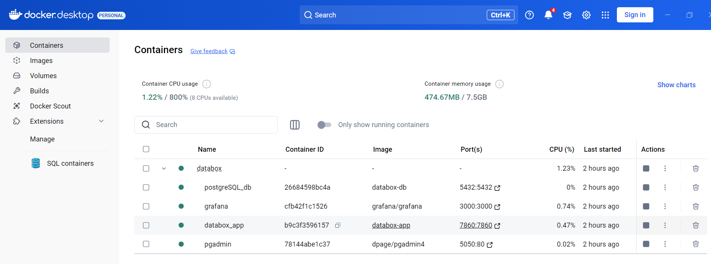
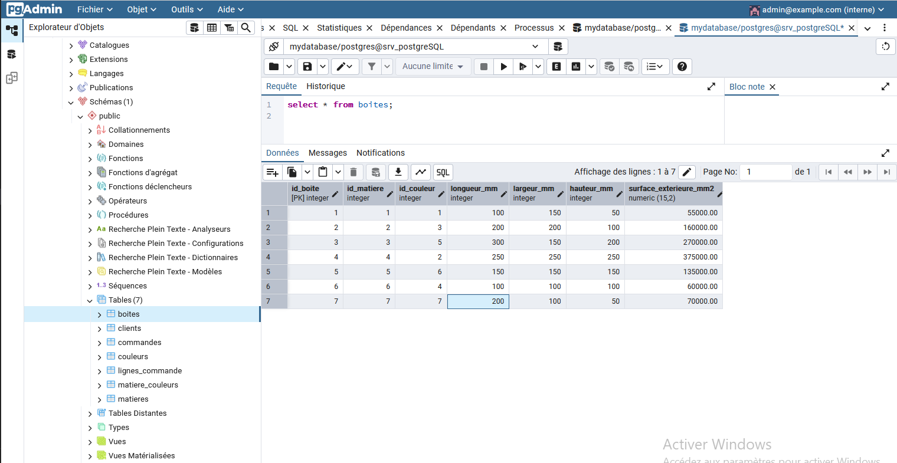
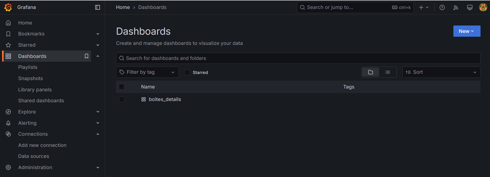
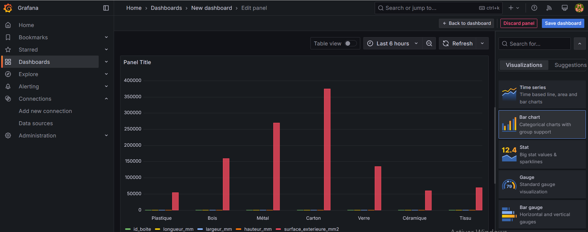
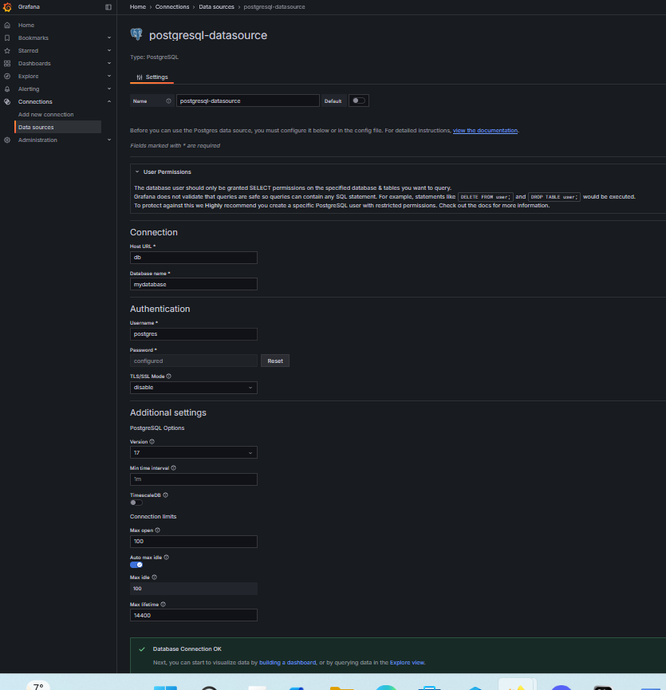

# Projet de création d'une base de données pour une PME de boîtes personnalisables

Ce projet a pour objectif de créer une base de données relationnelle en PostgreSQL pour gérer les commandes clients d'une PME qui fabrique des boîtes de rangement personnalisables.

## Objectifs

*   Modéliser une base de données pour répondre à un besoin.
*   Créer une base de données relationnelle en SQL pour stocker les commandes des clients, les produits, et les calculs associés.
*   Automatiser la logique de gestion des contraintes.
*   Produire des analyses basiques pour valider la cohérence et l'utilité de la base de données.

## Auteur

© 2025 Olivier LAVAUD


## Prérequis

*   [Docker Desktop](https://www.docker.com/products/docker-desktop/) pour un deploiement par conteneur

## Installation

1.  **Clonez le dépôt :**

    ```bash
    git clone https://github.com/OlivierLAVAUD/dataset-boites.git
    cd dataset-boites
    ```

2.  **Lancez le conteneur avec Docker Compose :**

    ```bash
    docker-compose up -d
    ```




3.  **Accédez aux services applicatifs**
    - app [http://localhost:7860](http://localhost:7860/)
    - pgAdmin [http://localhost:5050](http://localhost:5050/)
    - Grafana [http://localhost:3000](http://localhost:3000)

4.  **Accédez à la base de données et effectuer des requêtes SQL:**

    Vous pouvez maintenant accéder à la base de données PostgreSQL depuis votre machine avec la commande:
    ```bash
    docker exec -it postgreSQL_db psql -U postgres -d mydatabase
    ```

5.  **Exécutez des requêtes partir de fichier sql:**

    ```bash
        docker exec -it postgreSQL_db psql -U postgres -d mydatabase -f docker-entrypoint-initdb.d/databox.sql
    ```
    


6. **Gérez la base de données avec l'interface pgAdmin**

  Vous pouvez maintenant accéder à l'application Pgadmin et intérroger la base de données PostgreSQL depuis votre navigateur [http://localhost:5050](http://localhost:5050/)



- Paramétrage initial
```bash
    Server Name [PostgreSQL]
    Nom d'hôte / Adresse [db] 
    Port [5432]
    Base de données [mydatabase]
    Utilisateur [postgres]
    Mot de passe [yourpassword]
    Rôle []
    Service []
```


7. **Realisez des graphiques et des Dashboards à partir de l' interface Graphana**

  Vous pouvez maintenant accéder à l'application Grafana et concevoir des Dashboards depuis votre navigateur [http://localhost:3000](http://localhost:3000)




### Les paramétrages de Grafana
- Connexion initiale administrateur
```
    Utilisateur [admin]
    Mot de passe [admin]
```

- Ajout d'une source de données



8. **Exécutez des requetes directement à partir de Python avec une interface frontend Gradio:**

    Vous pouvez maintenant accéder à l'application app et effectuer des requêtes sur la base de données PostgreSQL depuis votre navigateur avec une interface Gradio [http://localhost:7860](http://localhost:7860/)


## Diagramme du Modèle Logique des Données (MLD)

* visualisez le script [sql/databox.sql](https://github.com/OlivierLAVAUD/dataset-boites/blob/master/sql/databox.sql)

* visualisez le modèle MLD généré à partir du contenu du fichier MLD.dbml avec https://dbdiagram.io/d


## Points Clés du Brief Respectés

*   **Modélisation :** Les relations entre clients, c   ommandes et boîtes sont correctement modélisées.
*   **Contraintes :** Les contraintes de dimensions (maximum 1 mètre) et de format de code client (xx-123) sont implémentées.
*   **Calcul de prix :** La surface extérieure est calculée et stockée. Le brief mentionne un tarif dégressif en fonction des quantités, ce qui est implémenté dans la table `LIGNES_COMMANDE` avec le champ `taux_remise`.
*   **Personnalisation :** La matière et la couleur sont gérées, et la table `MATIERE_COULEURS` permet de gérer les couleurs spécifiques à certaines matières.


