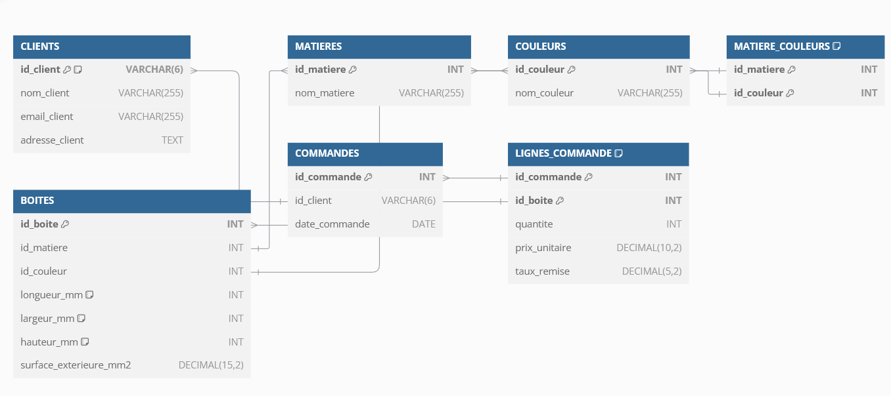
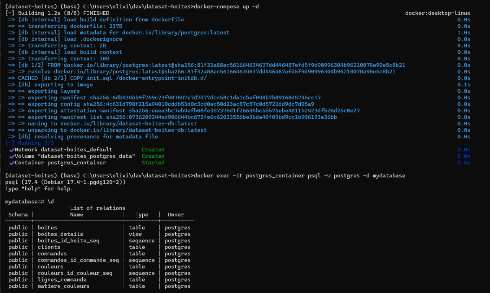
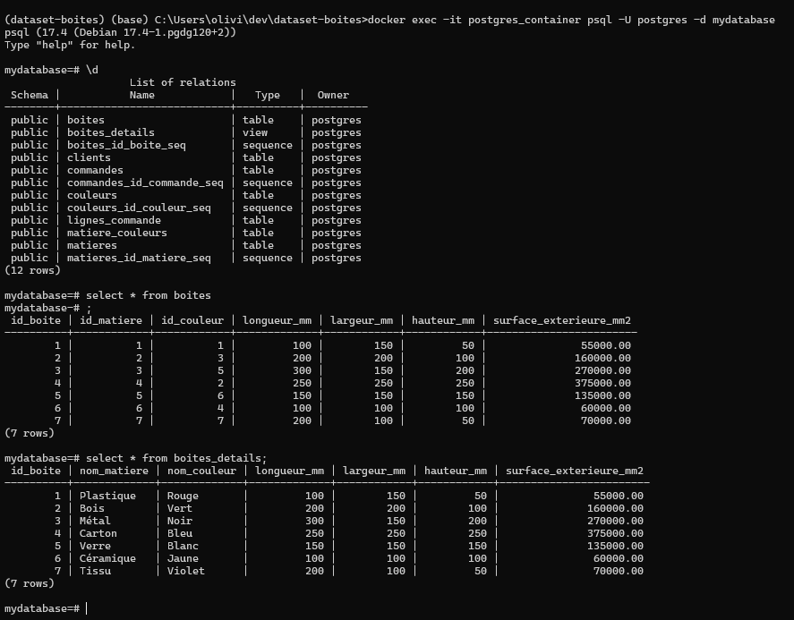
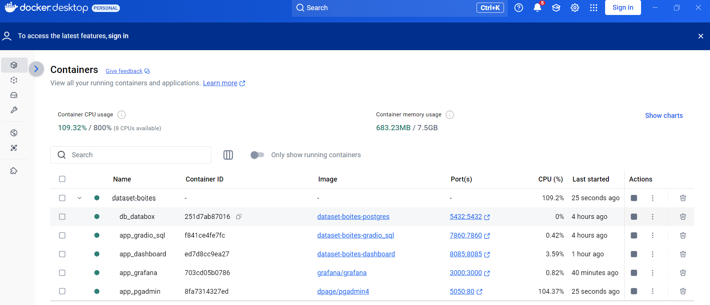

# Projet de création d'une base de données pour une PME de boîtes personnalisables

Ce projet a pour objectif de créer une base de données relationnelle en PostgreSQL pour gérer les commandes clients d'une PME qui fabrique des boîtes de rangement personnalisables.

## Objectifs

*   Modéliser une base de données pour répondre à un besoin.
*   Créer une base de données relationnelle en SQL pour stocker les commandes des clients, les produits, et les calculs associés.
*   Automatiser la logique de gestion des contraintes.
*   Produire des analyses basiques pour valider la cohérence et l'utilité de la base de données.

## Auteur

© 2025 Olivier LAVAUD



## Prérequis

*   [Docker Desktop](https://www.docker.com/products/docker-desktop/) pour un deploiement par conteneur
or 
*   [Postgres Database Server] ( https://www.enterprisedb.com/downloads/postgres-postgresql-downloads) pour une utilisation locale sous Windows ou Linux

## Installation et configuration avec Docker


1.  **Clonez le dépôt :**

    ```bash
    git clone https://github.com/OlivierLAVAUD/dataset-boites.git
    cd dataset-boites
    ```

2.  **Créez un fichier `.env` (facultatif) :**

    Si vous souhaitez personnaliser les variables d'environnement (utilisateur, mot de passe, nom de la base de données), créez un fichier `.env` à la racine du projet et définissez les variables suivantes :

    ```
    POSTGRES_USER=mon_utilisateur
    POSTGRES_PASSWORD=mon_mot_de_passe
    POSTGRES_DB=ma_base_de_donnees
    ```

    Si vous ne créez pas ce fichier, les valeurs par défaut définies dans le `docker-compose.yml` seront utilisées.

3.  **Lancez le conteneur avec Docker Compose :**

    ```bash
    docker-compose up -d
    ```

    Cette commande va :

    *   Créer et démarrer un conteneur PostgreSQL en utilisant l'image `postgres:latest`.
    *   Définir les variables d'environnement (utilisateur, mot de passe, nom de la base de données).
    *   Exposer le port 5432 pour permettre l'accès à la base de données.
    *   Exécuter le script SQL `init.sql` pour créer la base de données et les tables.
    *   Créer un volume Docker pour stocker les données de la base de données de manière persistante.

4.  **Accédez à la base de données et effectuer des requêtes SQL:**

    Vous pouvez maintenant accéder à la base de données PostgreSQL depuis votre machine avec la commande:
    ```bash
    docker exec -it postgres_container psql -U postgres -d mydatabase
    ```

5.  **Executer des requetes sql à partir de fichier sql:**
    ```bash
        docker exec -it postgres_container psql -U postgres -d mydatabase -f docker-entrypoint-initdb.d/init.sql
    ```


6. **Executer des requetes directement à partir d'une interface SQL avec gradio en frontend:**


    Vous pouvez maintenant accéder à l'application app et interoger la base de données PostgreSQL depuis votre navigateur [http://localhost:7860](http://localhost:7860/)


## Structure du projet
 ```bash
├── docker-compose.yml # Configuration Docker Compose
├── Dockerfile # Configuration Docker
├── init.sql # Script SQL pour la création de la base de données
├── README.md # Ce fichier
 ```


## Description des fichiers

*   **`docker-compose.yml` :** Ce fichier définit la configuration du conteneur Docker pour la base de données PostgreSQL. Il spécifie l'image à utiliser, les variables d'environnement, le mapping des ports et les volumes.
*   **`Dockerfile` :** Ce fichier décrit comment construire une image Docker personnalisée. Dans ce projet, il est utilisé pour copier le script SQL `init.sql` dans le conteneur.
*   **`init.sql` :** Ce fichier contient le script SQL qui sera exécuté lors du premier démarrage du conteneur pour créer la base de données, les tables, les contraintes, les triggers et les vues.
*   **`README.md` :** Ce fichier fournit des instructions sur la configuration et l'exécution du projet.

## Diagramme du Modèle Logique des Données (MLD)


* visualisez le MLD avec langage de description ci-dessous (MLD.dbml) avec https://dbdiagram.io/d

```dbdiagram
Table CLIENTS {
  id_client VARCHAR(6) [pk, unique, note: 'Format: xx-123']
  nom_client VARCHAR(255)
  email_client VARCHAR(255)
  adresse_client TEXT
}

Table MATIERES {
  id_matiere INT [pk, increment]
  nom_matiere VARCHAR(255) [unique]
}

Table COULEURS {
  id_couleur INT [pk, increment]
  nom_couleur VARCHAR(255) [unique]
}

Table MATIERE_COULEURS {
  id_matiere INT [pk]
  id_couleur INT [pk]
}

Table BOITES {
  id_boite INT [pk, increment]
  id_matiere INT
  id_couleur INT
  longueur_mm INT [note: 'Max: 1000']
  largeur_mm INT [note: 'Max: 1000']
  hauteur_mm INT [note: 'Max: 1000']
  surface_exterieure_mm2 DECIMAL(15,2)
}

Table COMMANDES {
  id_commande INT [pk, increment]
  id_client VARCHAR(6)
  date_commande DATE
}

Table LIGNES_COMMANDE {
  id_commande INT [pk]
  id_boite INT [pk]
  quantite INT
  prix_unitaire DECIMAL(10,2)
  taux_remise DECIMAL(5,2)
}

Ref: MATIERE_COULEURS.id_matiere < MATIERES.id_matiere
Ref: MATIERE_COULEURS.id_couleur < COULEURS.id_couleur
Ref: BOITES.id_matiere < MATIERES.id_matiere
Ref: BOITES.id_couleur < COULEURS.id_couleur
Ref: COMMANDES.id_client < CLIENTS.id_client
Ref: LIGNES_COMMANDE.id_commande < COMMANDES.id_commande
Ref: LIGNES_COMMANDE.id_boite < BOITES.id_boite
```
 
## Points Clés du Brief Respectés

*   **Modélisation :** Les relations entre clients, commandes et boîtes sont correctement modélisées.
*   **Contraintes :** Les contraintes de dimensions (maximum 1 mètre) et de format de code client (xx-123) sont implémentées.
*   **Calcul de prix :** La surface extérieure est calculée et stockée. Le brief mentionne un tarif dégressif en fonction des quantités, ce qui est implémenté dans la table `LIGNES_COMMANDE` avec le champ `taux_remise`.
*   **Personnalisation :** La matière et la couleur sont gérées, et la table `MATIERE_COULEURS` permet de gérer les couleurs spécifiques à certaines matières.


