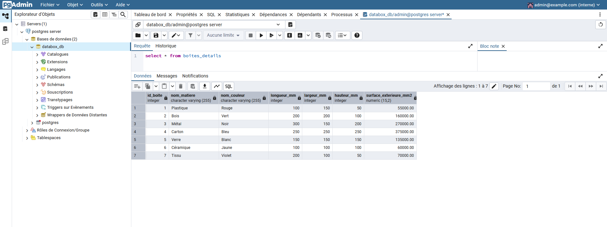

# Projet de création d'une base de données pour une PME de boîtes personnalisables

Ce projet a pour objectif de créer une base de données relationnelle en PostgreSQL pour gérer les commandes clients d'une PME qui fabrique des boîtes de rangement personnalisables.

## Objectifs

*   Modéliser une base de données pour répondre à un besoin.
*   Créer une base de données relationnelle en SQL pour stocker les commandes des clients, les produits, et les calculs associés.
*   Automatiser la logique de gestion des contraintes.
*   Produire des analyses basiques pour valider la cohérence et l'utilité de la base de données.

## Auteur

© 2025 Olivier LAVAUD


## Prérequis

*   [Docker Desktop](https://www.docker.com/products/docker-desktop/) pour un deploiement par conteneur
or 
*   [Postgres Database Server] ( https://www.enterprisedb.com/downloads/postgres-postgresql-downloads) pour une utilisation locale sous Windows ou Linux

## Installation et configuration avec Docker


1.  **Clonez le dépôt :**

    ```bash
    git clone https://github.com/OlivierLAVAUD/dataset-boites.git
    cd dataset-boites
    ```

2.  **Créez un fichier `.env` (facultatif) :**

    Si vous souhaitez personnaliser les variables d'environnement (utilisateur, mot de passe, nom de la base de données), créez un fichier `.env` à la racine du projet et définissez les variables suivantes :

    ```
    POSTGRES_USER=mon_utilisateur
    POSTGRES_PASSWORD=mon_mot_de_passe
    POSTGRES_DB=ma_base_de_donnees
    ```

    Si vous ne créez pas ce fichier, les valeurs par défaut définies dans le `docker-compose.yml` seront utilisées.

3.  **Lancez le conteneur avec Docker Compose :**

    ```bash
    docker-compose up -d
    ```
    Cette commande va :

    *   Créer et démarrer un conteneur PostgreSQL_db en utilisant l'image `postgres:latest`.
    *   Créer et démarrer un conteneur databox_app et creer un connexion avec l'url de la base de donnée: `postgres://postgres:yourpassword@db:5432/mydatabase` .
    *   Définir les variables d'environnement (utilisateur, mot de passe, nom de la base de données).
    *   Exposer le port 5432 pour permettre l'accès à la base de données.
    *   Exposer le port 7860 pour permettre l'accès à l'interface frontend Gradio.
    *   Exécuter le script SQL `sql/databox.sql` pour créer la base de données et les tables.
    *   Créer un volume Docker pour stocker les données de la base de données de manière persistante.


4.  **Accédez à la base de données et effectuer des requêtes SQL:**

    Vous pouvez maintenant accéder à la base de données PostgreSQL depuis votre machine avec la commande:
    ```bash
    docker exec -it postgreSQL_db psql -U postgres -d mydatabase
    ```

5.  **Executer des requetes sql à partir de fichier sql:**
    ```bash
        docker exec -it postgreSQL_db psql -U postgres -d mydatabase -f docker-entrypoint-initdb.d/databox.sql
    ```


6. **Exécutez des requetes directement à partir d'une interface SQL avec gradio en frontend:**

    Vous pouvez maintenant accéder à l'application app et intérroger la base de données PostgreSQL depuis votre navigateur [http://localhost:7860](http://localhost:7860/)


6. **Exécutez des requetes directement à partir de l' interface Pgadmin**



  Vous pouvez maintenant accéder à l'application Pgadmin et intérroger la base de données PostgreSQL depuis votre navigateur [http://localhost:5050](http://localhost:5050/)

- Configuration Initiale
    Server Name [PostgreSQL]
    Nom d'hôte / Adresse [db] 
    Port [5432]
    Base de données [mydatabase]
    Utilisateur [postgres]
    Mot de passe [yourpassword]
    Rôle []
    Service []


7. **Realisez des graphiques et des Dashboards à partir de l' interface Graphana**


  Vous pouvez maintenant accéder à l'application Pgadmin et intérroger la base de données PostgreSQL depuis votre navigateur [http://localhost:3000](http://localhost:3000)

- Connexion à Grafana
    Utilisateur [admin]
    Mot de passe [admin]

- Ajouter la source de données db


- Créez des DashBoards


## Diagramme du Modèle Logique des Données (MLD)

* visualisez le fichier MLD.dbml avec https://dbdiagram.io/d


## Points Clés du Brief Respectés

*   **Modélisation :** Les relations entre clients, commandes et boîtes sont correctement modélisées.
*   **Contraintes :** Les contraintes de dimensions (maximum 1 mètre) et de format de code client (xx-123) sont implémentées.
*   **Calcul de prix :** La surface extérieure est calculée et stockée. Le brief mentionne un tarif dégressif en fonction des quantités, ce qui est implémenté dans la table `LIGNES_COMMANDE` avec le champ `taux_remise`.
*   **Personnalisation :** La matière et la couleur sont gérées, et la table `MATIERE_COULEURS` permet de gérer les couleurs spécifiques à certaines matières.


