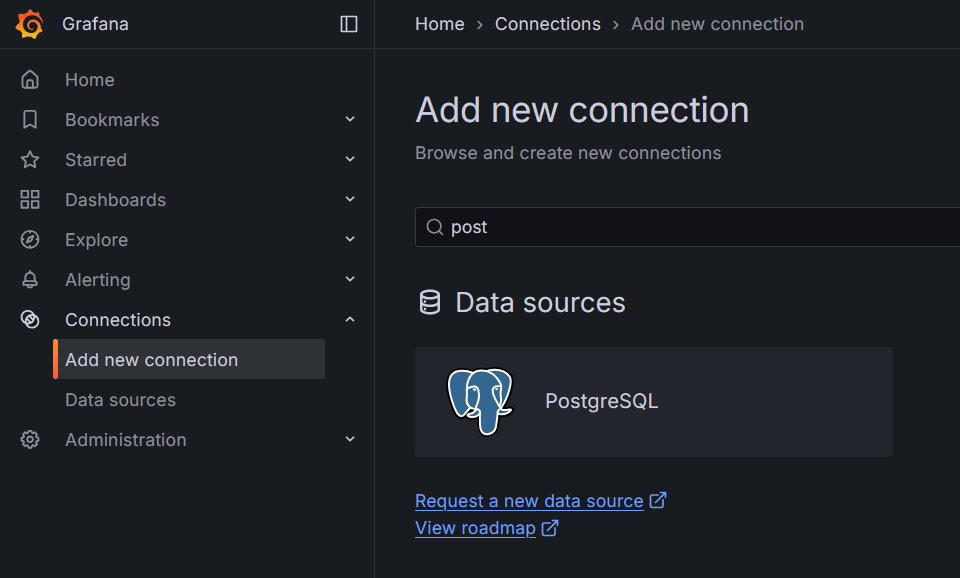
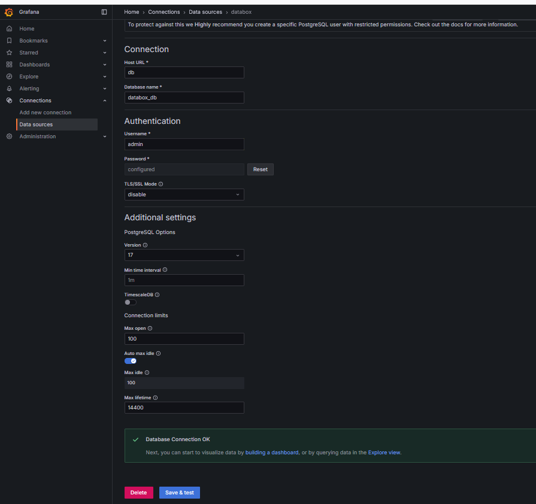
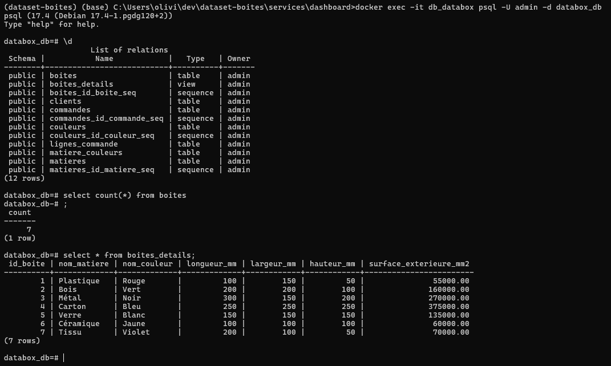

# Projet de création d'une base de données pour une PME de boîtes personnalisables

Ce projet a pour objectif de créer une base de données relationnelle en PostgreSQL pour gérer les commandes clients d'une PME qui fabrique des boîtes de rangement personnalisables.

## Objectifs

*   Modéliser une base de données pour répondre à un besoin.
*   Créer une base de données relationnelle en SQL pour stocker les commandes des clients, les produits, et les calculs associés.
*   Automatiser la logique de gestion des contraintes.
*   Produire des analyses basiques pour valider la cohérence et l'utilité de la base de données.

[Rapport Databox](https://github.com/OlivierLAVAUD/dataset-boites/blob/master/docs/Rapport%20Databox.pdf)


## Auteur
© 2025 Olivier LAVAUD

## Modélisation


## Prérequis

*   Installation de [Docker Desktop](https://www.docker.com/products/docker-desktop/)

## Installation

1.  **Clonez le dépôt :**

    ```bash
    git clone https://github.com/OlivierLAVAUD/dataset-boites.git
    cd dataset-boites
    ```

2.  **Lancez le conteneur avec Docker Compose :**
- Pour lancer tous les services tapez la commande ci-dessous
    ```bash
    docker-compose up -d
    ```
- Pour lancer les services essentiels et minimaux
    ```bash
    docker-compose up postrgres grafana
    ```
docker-compose up -d --build airflow_scheduler


3.  **Accédez aux services**
    - db_databox 
    - app_pgAdmin   [http://localhost:5050](http://localhost:5050/)
    - app_Grafana   [http://localhost:3000](http://localhost:3000)
    - app_dashboard [http://localhost:8085](http://localhost:8085)
    - app_gradio_sql [http://localhost:7860](http://localhost:7860)
    - airflow        [http://localhost:8080](http://localhost:8080)
    - airflow_scheduler

4. **Instanciez et Gérez la base de données avec l'interface pgAdmin**

Vous pouvez maintenant accéder à l'application Pgadmin et intérroger la base de données PostgreSQL depuis votre navigateur [http://localhost:5050](http://localhost:5050/)

<div style="display: flex; justify-content: center; align-items: center; flex-wrap: wrap;">
    
    
</div>


5. **Realisez des graphiques et des Dashboards à partir de l'interface Graphana**
Vous pouvez maintenant accéder à l'application Grafana et concevoir des Dashboards depuis votre navigateur [http://localhost:3000](http://localhost:3000)
<div style="display: flex;">


</div>

### Les paramétrages de Grafana
<div style="display: flex;">
  
  
  
</div>

<div style="display: flex;">

</div>


6. **Exécutez des requetes directement à partir d'une interface SQL avec gradio en frontend:**
Vous pouvez maintenant accéder à l'application app et intérroger la base de données PostgreSQL depuis votre navigateur [http://localhost:7860](http://localhost:7860/)


7. **Visualisez des statistiques avec un Dashboard avec plotly et python:**
    - app_dashboard [http://localhost:8085](http://localhost:8085)


8.  **Accédez à la base de données et effectuer des requêtes SQL:**
Vous pouvez maintenant accéder à la base de données PostgreSQL depuis votre machine avec la commande:
```bash
docker exec -it db_databox psql -U admin -d databox_db
```


9.  **Exécutez des requêtes partir de fichier sql:**
```bash
docker exec -it db_databox psql -U admin -d databox_db -f docker-entrypoint-initdb.d/databox.sql
```

## Diagrammes UML & MLD (Modèle Logique des Données)
* visualisez le modèle UML généré à partir du contenu du fichier [databox.uml](https://github.com/OlivierLAVAUD/dataset-boites/blob/master/docs/databox.uml) avec [plantuml](https://www.plantuml.com)
<div style="display: flex; justify-content: center; align-items: center; flex-wrap: wrap;">
  
</div>

* visualisez le modèle MLD généré à partir du contenu du fichier  [mld.dbml](https://github.com/OlivierLAVAUD/dataset-boites/blob/master/docs/mld.dbml) avec [dbdiagram](https://dbdiagram.io/d)


* visualisez le script [services/postrgres/sql/databox.sql](https://github.com/OlivierLAVAUD/dataset-boites/blob/master/services/postgres/sql/databox.sql)


10. Gérer les pipelines ETL avec Airflow (DAGs)

* [Airflow](http://localhost:8080)
<div style="display: flex; justify-content: center; align-items: center; flex-wrap: wrap;">
  
</div>


## Points Clés du Brief Respectés

*   **Modélisation :** Les relations entre clients, c   ommandes et boîtes sont correctement modélisées.
*   **Contraintes :** Les contraintes de dimensions (maximum 1 mètre) et de format de code client (xx-123) sont implémentées.
*   **Calcul de prix :** La surface extérieure est calculée et stockée. Le brief mentionne un tarif dégressif en fonction des quantités, ce qui est implémenté dans la table `LIGNES_COMMANDE` avec le champ `taux_remise`.
*   **Personnalisation :** La matière et la couleur sont gérées, et la table `MATIERE_COULEURS` permet de gérer les couleurs spécifiques à certaines matières.

## Statistiques avec Dashboards réalisées Grafana à partir de vues SQL

* visualisez le script des vues [services/postrgres/sql/views.sql](https://github.com/OlivierLAVAUD/dataset-boites/blob/master/services/postgres/sql/views.sql)


<div style="display: flex; justify-content: center; align-items: center; flex-wrap: wrap;">
  
  
  
  
  
  
  
  
</div>
